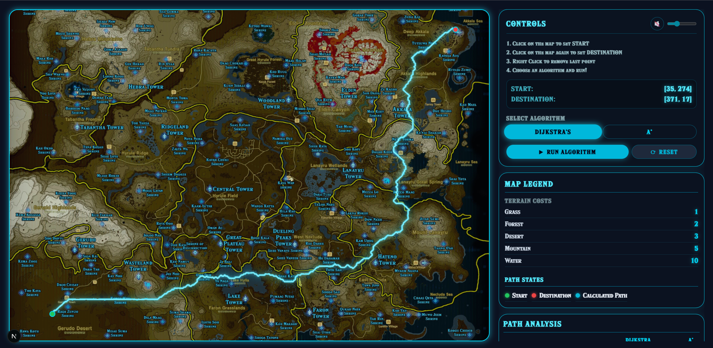

# Zelda Breath Of The Wild Pathfinder

Interactive pathfinder visualizer built with a C++ backend engine and a Next.js frontend. This project simulates the Sheikah slate interface from the game "The Legend of Zelda : Breath of The Wild" to demonstrate weighted pathfinding algorithms traversing through Hyrule.

## Important Features:

* **Weighted Terrain Cost**: Real time path finding calculation, including grass(1), Forest(2), Desert(3), Mountain(5), and Water(10).

* **Algorithm Implementation**: custom built Dijkstra's and A* search algorithms performance comparison.

* **Interactive UI**: Full zoom/pan support, custom map markers, sound effects, and real time animation display for the final path.

* Immersive Aesthetic: Hylia Serif font, Sheikah SFX, integrated background music, with the ability to decrease/increase volume.

## Tech Used

* **Engine**: C++
* **Frontend**: React, Next.js, Tailwind CSS 4
* **Bridge**: Node.js child_process API for native execution.

## Data Structures Used:

The core engine was implemented from scratch using C++ for maximum performance and fast traversal.

* **Dijkstra's Algorithm**: Guarantees shortest path by exploring all directions based on cumulative cost.

* **A***: Optimized traversal using Manhattan Distance heuristic to prioritize nodes closer to the destination.

* **Note**: 8 way movement was implemented to ensure diagonal traversal with distance corrected costs for a more natural path.

## Requirements:

* C++ compiler (either g++ or clang)
* Node.js (v18+)
* npm

## Getting Started:

* Navigate to the root directory and compile the pathfinder engine: g++ -O3 pathfinder.cpp -o pathfinder

* Navigate to the "frontend" folder, by using `cd frontend` and `npm install`

* Run development server: `npm run dev` and copy the link locally provided by the terminal, usually looks like `http://localhost:3000`

* If you are using CMake (ex. CLion), run the following commands:

  * `cmake -B build`

  * `cmake --build build`

  And proceed to run the frontend with previous steps.

## Team Members and GitHub usernames:
* Henry Paz, HenryPazS
* Bruno Carballo, Brunocar15

Screenshot:

